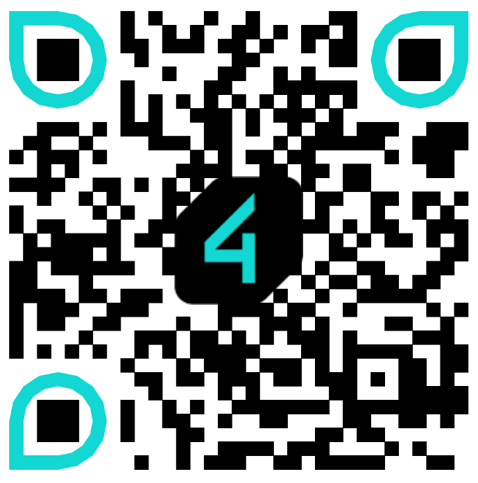
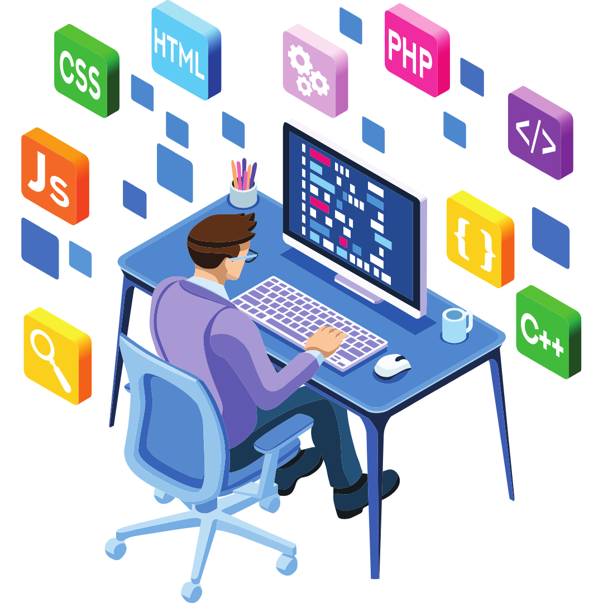
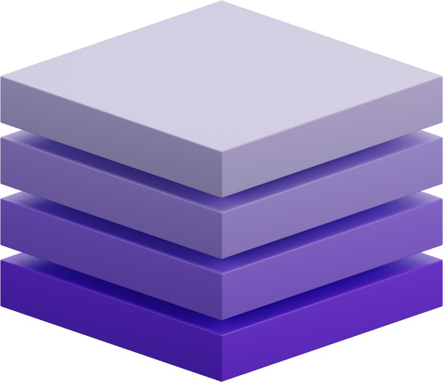
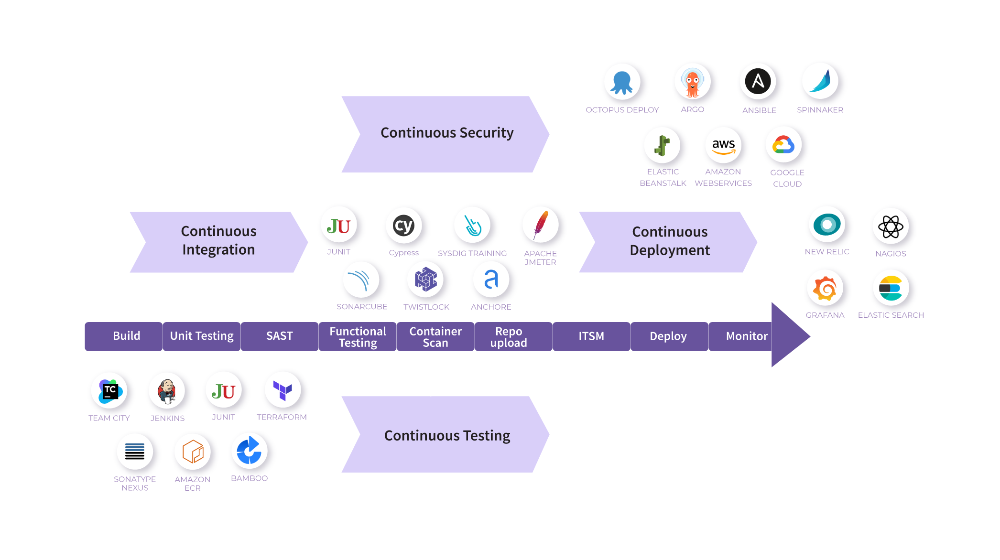

<!-- _backgroundImage: url('images/bg.png') -->

<!-- _paginate: false -->

# Desvendando o poder do **DevSecOps** com Software Livre
###
Samuel Gonçalves

---
<!-- _backgroundImage: url('images/bg-devsecops-heroes.jpg') -->

<!-- _paginate: false -->

# DevSecOps Heroes

---

<!-- _paginate: false -->
> ##  *A ciência da computação não é mais sobre computadores do que a astronomia é sobre telescópios.*

*Edsger Dijkstra*

---

<!-- _paginate: false -->

#### 🇧🇷 Samuel Gonçalves

* Tech Lead na 4Linux
* Consultor de Tecnologia nas áreas **Segurança Ofensiva** e **DevSecOps**
* Mais de 10 anos de experiência 💻
* *"6k++"* alunos ensinados no 🌎
* Músico, Contista, YouTuber e Podcaster
* Apaixonado por Software Livre 💙
* Contato: [https://beacons.ai/sgoncalves](https://beacons.ai/sgoncalves)

---

### CONCORRA A UMA ASSINATURA DA 4LINUX!

#### É só escanear e se inscrever!

---

### Esses slides são OpenSource! 
Escaneie e acesse!

---

## Previna, detecte e responda!

- Segurança da informação é um processo em constante evolução.
- É uma jornada contínua, não um destino final.
- Fases do processo de Segurança da Informação: prevenção, detecção e resposta.
- Engloba diversas estratégias e atividades ao longo dessas fases.

---

<!-- _backgroundImage: url('images/bg-purple.png') -->
<!-- _paginate: false -->
## Segurança em camadas

---

<!-- _backgroundImage: url('images/bg-1.jpg') -->
<!-- _paginate: false -->

## Proteja seu código!
#
#
* **Prevenção de Vulnerabilidades:** Proteger o código desde o início reduz riscos de exploração por hackers.
* **Redução de Custos:** Corrigir falhas na fase de desenvolvimento é mais econômico do que após implantação.
* **Preservação de Reputação:** Evita violações de segurança que podem prejudicar a confiança dos clientes.
* **Conformidade:** Muitas regulamentações exigem medidas de segurança no desenvolvimento.

---

### Ferramentas para SAST

Ferramenta        | Linguagem               | Link para acesso
:---------------: |:-----------------------:|:----------------:
Semgrep           | Diversas Linguagens     | [https://github.com/returntocorp/semgrep](https://github.com/returntocorp/semgrep)
SonarQube         | 27 linguagens           | [https://www.sonarqube.org/](https://www.sonarqube.org/)
Bearer            | Java, Ruby, JavaScript and TypeScrip | [https://github.com/bearer/bearer](https://github.com/bearer/bearer)
Horusec           | Várias linguagens       | [https://horusec.io/](https://horusec.io/site/)
MobSF             | Android Java, Objective C, Swift     | [https://mobsf.github.io/Mobile-Security-Framework-MobSF/](https://mobsf.github.io/Mobile-Security-Framework-MobSF/)
huskyCI           | Python, Ruby, JavaScript, Golang e Java | [https://github.com/globocom/huskyCI](https://github.com/globocom/huskyCI)

---

<!-- _backgroundImage: url('images/bg-2.jpg') -->
<!-- _paginate: false -->

## Proteja as dependências!

* **Riscos de Componentes de Terceiros:** Componentes vulneráveis podem ser explorados por atacantes.
* **Complexidade do Ecossistema:** Software moderno depende de muitas bibliotecas, aumentando o risco.
* **Atualizações e Patches:** Monitorar e aplicar correções reduz riscos ao longo do tempo.

---

<!-- _backgroundImage: url('images/bg-3.jpg') -->
<!-- _paginate: false -->
## Proteja seus containers!

* **Isolamento de Aplicações:** Os contêineres oferecem isolamento, mas requerem configurações seguras.
* **Cadeia de Fornecimento:** Contêineres frequentemente incluem código de terceiros, aumentando o risco.
* **Escalabilidade:** Como as aplicações são fragmentadas, muitas instâncias exigem proteção coordenada. 

---

### Scanners para Containers

Ferramenta        |  Link para acesso
:---------------: |:----------------:
lynis             | [https://github.com/CISOfy/lynis](https://github.com/CISOfy/lynis)
openSCAP          | [https://www.open-scap.org/](https://www.open-scap.org/)
Clair             | [https://github.com/quay/clair](https://github.com/quay/clair)
Trivy             | [https://github.com/aquasecurity/trivy](https://github.com/aquasecurity/trivy)

---

<!-- _backgroundImage: url('images/bg-4.jpg') -->
<!-- _paginate: false -->

## Proteja sua aplicação em execução!

* **Validação Realista:** Simulações de ataques reais revelam vulnerabilidades como um invasor faria.
* **Cobertura Abrangente:** Aborda questões de segurança em todas as camadas da aplicação web.
* **Aplicações em Evolução:** Acomoda mudanças frequentes, como atualizações de código e configurações.

---

### Ferramentas OpenSource para DAST

Ferramenta        |  Link para acesso
:---------------: |:----------------:
OwaspZAP          | [https://www.zaproxy.org/](https://www.zaproxy.org/)
Owasp Purple Team | [https://github.com/purpleteam-labs](https://github.com/purpleteam-labs)
Arachni          | [https://www.arachni-scanner.com/](https://www.arachni-scanner.com/)
SQLmap           | [http://sqlmap.org/](http://sqlmap.org/)
Gauntlt          | [http://gauntlt.org/](http://gauntlt.org)
BDD Security     | [https://github.com/iriusrisk/bdd-security](https://github.com/iriusrisk/bdd-security)
Nikto            | [https://github.com/sullo/nikto](https://github.com/sullo/nikto)
Golismero        | [https://github.com/golismero/golismero](https://github.com/golismero/golismero)

---

<!-- _backgroundImage: url('images/bg-5.jpg') -->
<!-- _paginate: false -->

## Proteja seu ambiente!

* **Redução de Riscos:** Diminui a exposição a ameaças cibernéticas e ataques.
* **Proteção Proativa:** Reforça a segurança antes que ocorram violações.
* **Conformidade:** Atende a requisitos regulatórios e normas de segurança.

---

### Ferramentas OpenSource para Hardening

Ferramenta        |  Link para acesso
:---------------: |:----------------:
DevSec Hardening  | [https://github.com/dev-sec/ansible-collection-hardening](https://github.com/dev-sec/ansible-collection-hardening)
Ansible Hardening | [https://opendev.org/openstack/ansible-hardening](https://opendev.org/openstack/ansible-hardening)

---

<!-- _backgroundImage: url('images/bg-purple.png') -->
<!-- _paginate: false -->

## DevSecOps
#
#
Integração contínua e automatizada da segurança no processo de desenvolvimento e operações de software.

---

## Fundamentos **DevSecOps**

* Integração da segurança no ciclo de vida do desenvolvimento de software.
* Colaboração entre desenvolvedores, operações e profissionais de segurança.
* Automação de testes de segurança e correção de problemas.
* Cultura de segurança e conscientização de toda a equipe.

---

## Em **DevSecOps** a segurança é **Automatizada**
---

<!-- _paginate: false -->

---
<!-- _backgroundImage: url('images/bg-duvidas.png') -->
<!-- _paginate: false -->
# Q&A
#
#
#
#
#
#
#

---
<!-- _backgroundImage: url('images/bg-devsecops-heroes.jpg') -->
<!-- _paginate: false -->
# Demonstração prática!

---

## Obrigado!

Vamos nos conectar?
* **Site:** [sgoncalves.tec.br](https://sgoncalves.tec.br)
* **E-mail:** [samuel@sgoncalves.tec.br](https://sgoncalves.tec.br/contato)
* **Linkedin:** [linkedin.com/in/samuelgoncalvespereira/](linkedin.com/in/samuelgoncalvespereira/)
* **Telegram:** [t.me/Samuel_gp](t.me/Samuel_gp)
* **Todas as redes:** [https://beacons.ai/sgoncalves](https://beacons.ai/sgoncalves)

---
### Fontes Bibliográficas

[https://promovesolucoes.com/devsecops-seguranca-continua-lgpd/](https://promovesolucoes.com/devsecops-seguranca-continua-lgpd/)
[https://www.redhat.com/pt-br/topics/devops/what-is-devsecops](https://www.redhat.com/pt-br/topics/devops/what-is-devsecops)
[https://www.ibm.com/br-pt/cloud/learn/devsecops](https://www.ibm.com/br-pt/cloud/learn/devsecops)
[https://promovesolucoes.com/devsecops-seguranca-continua-lgpd/](https://promovesolucoes.com/devsecops-seguranca-continua-lgpd/)
[https://4linux.com.br/cursos/treinamento/devsecops-seguranca-em-infraestrutura-e-desenvolvimento-agil/](https://4linux.com.br/cursos/treinamento/devsecops-seguranca-em-infraestrutura-e-desenvolvimento-agil/)
[https://blog.4linux.com.br/devsecops-implementacao-em-6-passos/](https://blog.4linux.com.br/devsecops-implementacao-em-6-passos/)
[https://blog.gitguardian.com/security-tools-shift-left/](https://blog.gitguardian.com/security-tools-shift-left/)
[https://michelleamesquita.medium.com/entendendo-o-ciclo-de-vida-de-desenvolvimento-de-software-seguro-ssdlc-ccc173f583de](https://michelleamesquita.medium.com/entendendo-o-ciclo-de-vida-de-desenvolvimento-de-software-seguro-ssdlc-ccc173f583de)